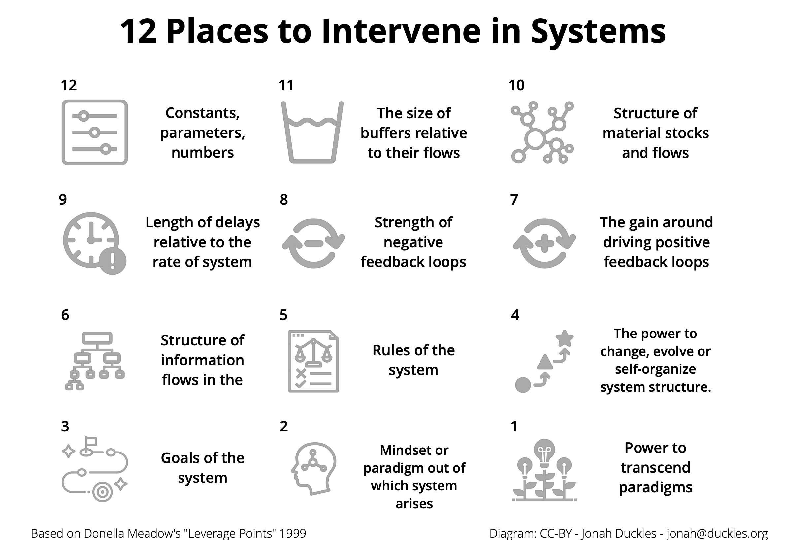

# 12 places to Intervene in Systems

This diagram is created as a way to communicate Donella Meadow's [12 Places to Intervene in Systems](http://www.donellameadows.org/wp-content/userfiles/Leverage_Points.pdf) in presentations I give. 

